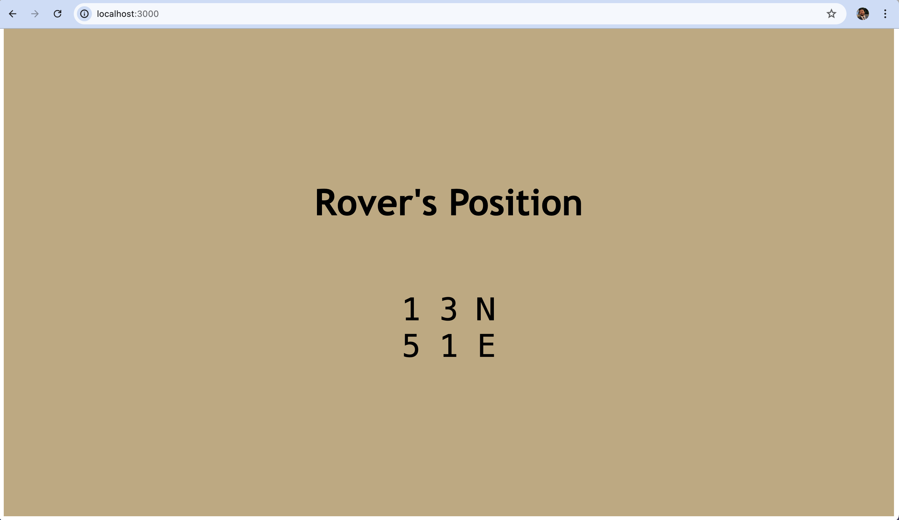

# Mars Rover

A squad of robotic rovers landed by NASA on a plateau on Mars trying to find their way. 

## Table of Contents

- [Installation](#installation)
- [Features](#features)
- [Testing](#testing)
- [Future Work](#future-work)

## Installation

To install the dependencies run:

`npm install`

And to run the app:

`npm start`

To access the app locally, go to: 

`http://localhost:3000`

### Features

- Implement the Rover class with properties for x-coordinate, y-coordinate, and direction.
- Include methods to turn left, turn right, and move forward based on the current direction.
- Include a method to execute a series of commands and update the rover's position accordingly.
- Include a method to return the rover's current position and direction as a formatted string.

- Refactoring for Clarity and Reusability:
    - Separate parsing logic into helper functions for better readability and reusability.
    - Ensure each function has a single responsibility and clear purpose.
    - Add JSDoc comments to describe the purpose and usage of each function and method.

- React Frontend showing the output results in the middle of the webpage.

## Testing

- Write unit tests for the helper functions (parsePlateauDimensions, parseRoverPosition, parseCommands).
- Write unit tests for the Rover class methods to ensure correct behavior.
- Write unit tests for the moveRover function to validate the overall functionality and integration.

You can run the unit tests using:

`npm test`
 

You can view the code coverage with the following command:

`npm test --coverage`

Here's the code coverage: 
 
File       | % Stmts | % Branch | % Funcs | % Lines | Uncovered Line #s 
-----------|---------|----------|---------|---------|-------------------
All files  |   98.66 |      100 |     100 |   98.21 |                   
 components |   98.27 |      100 |     100 |   97.61 |                   
  Rover.ts |   98.27 |      100 |     100 |   97.61 | 106               
 helpers   |     100 |      100 |     100 |     100 |                   
  helpers.ts |     100 |      100 |     100 |     100 |                   

## Future Work

1. Setup inputs in Frontend with validations to input coordinates & rover's orientation.
2. Tighten types by introducing ts interfaces & further tooling.
3. Refactor moveRover function into it's own file (help maintainence and testing).
4. Improve styling and responsive design.
5. Test for perfomance and consider setting up a CDN.